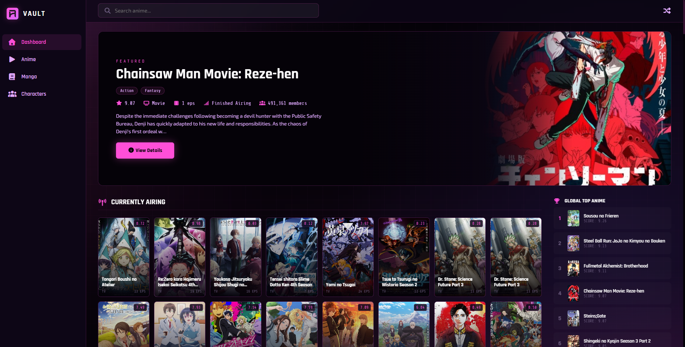

<div align="center">


# AnimeVault

**A neon-glassmorphism anime & manga discovery dashboard, powered by the Jikan (MyAnimeList) API.**

[](https://react.dev)
[](https://www.typescriptlang.org)
[](https://bun.sh)
[](https://jikan.moe)
[](#-license)

[**Live Demo**](https://jazsi.github.io/AnimeVault/)

</div>

---

## 📸 Preview

<div align="center">



</div>

---

## ✨ Features

- 🎬 **Rich dashboard** — top-rated, currently airing, this season, upcoming, and most popular anime, plus top/popular/ongoing manga.
- 🌀 **Auto-rotating hero** with genres, score, episodes, status, and synopsis for featured titles.
- 🏆 **Global rankings** sidebar for top anime, manga, and characters.
- 👥 **Most-favorited characters** grid.
- 🔎 **Search** that surfaces a full grid of matching anime.
- 🎲 **Random pick** to discover something new.
- 🪟 **Details modal** with banner, poster, stats, and synopsis for any title.
- 📱 **Fully responsive** from ultrawide down to mobile.
- ⚡ **Rate-limit aware** — a request queue serializes and throttles calls so the Jikan API is never hammered.

---

## 🛠 Tech Stack

| Area        | Choice                                                        |
| ----------- | ------------------------------------------------------------- |
| Runtime     | [Bun](https://bun.sh)  |
| UI          | [React 19](https://react.dev) + TypeScript                    |
| Styling     | CSS        |
| Icons       | [Font Awesome](https://fontawesome.com)    |
| Data        | [Jikan v4](https://jikan.moe) — unofficial MyAnimeList API    |

---

## 🚀 Getting Started

### Prerequisites

- [Bun](https://bun.sh) `1.3+`

### Installation

```bash
git clone https://github.com/JAZSI/AnimeVault.git
cd AnimeVault
bun install
```

### Development

```bash
bun dev
```

Then open the URL printed in the console (defaults to `http://localhost:3000`).

---

## 📦 Scripts

| Command            | Description                                              |
| ------------------ | -------------------------------------------------------- |
| `bun dev`          | Start the local dev server with live re-bundling.        |
| `bun run build`    | Production build to `dist/` (root-relative assets).      |
| `bun run build:gh` | Production build for GitHub Pages (base path `/AnimeVault/`). |
| `bun start`        | Serve a production build.                                |

---

## 🗂 Project Structure

```text
src/
├─ components/
│  ├─ layout/    Sidebar · Header · MainLayout
│  ├─ anime/     HeroSlider · MediaCard · MediaGrid · RankList · CharacterGrid · MediaModal
│  └─ ui/        Section · Spinner · Skeleton · LoadingScreen · StateMessage · ToastContainer
├─ pages/        Dashboard · SearchResults
├─ hooks/        useAsync · useAnimeData · useAnimeSearch · useMediaDetails
├─ context/      ModalContext · ToastContext · SearchContext
├─ services/     jikanApi (HTTP + rate-limit queue) · animeService (endpoints + normalization)
├─ styles/       variables.css · globals.css
├─ types/        jikan.ts
├─ assets/       logo.svg
├─ App.tsx       Provider composition + page switch
├─ frontend.tsx  React entry point
└─ index.html    HTML entry point
```

---

## 🌐 Deployment

Pushing to `main` triggers the [`deploy.yml`](.github/workflows/deploy.yml) workflow, which builds with `build:gh` and publishes `dist/` to GitHub Pages.

> **Note:** the base path is set to `/AnimeVault/` (see `build:gh`). It must match your repository name so assets resolve correctly — update the `--public-path` flag if you rename the repo.

---

## 🙏 Credits

- Data provided by the [Jikan API](https://jikan.moe), an unofficial [MyAnimeList](https://myanimelist.net) API.
- AnimeVault is a fan-made, non-commercial project and is not affiliated with MyAnimeList.

---

## 📄 License

Released under the [MIT License](LICENSE).
